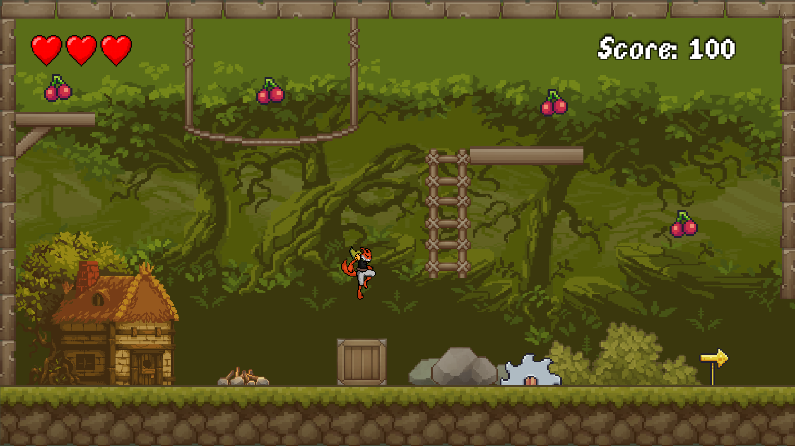
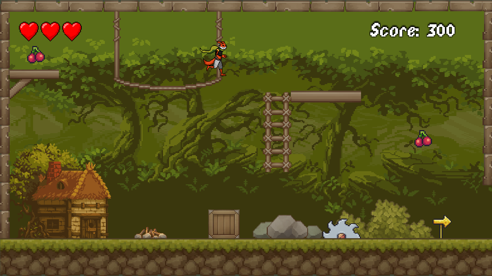
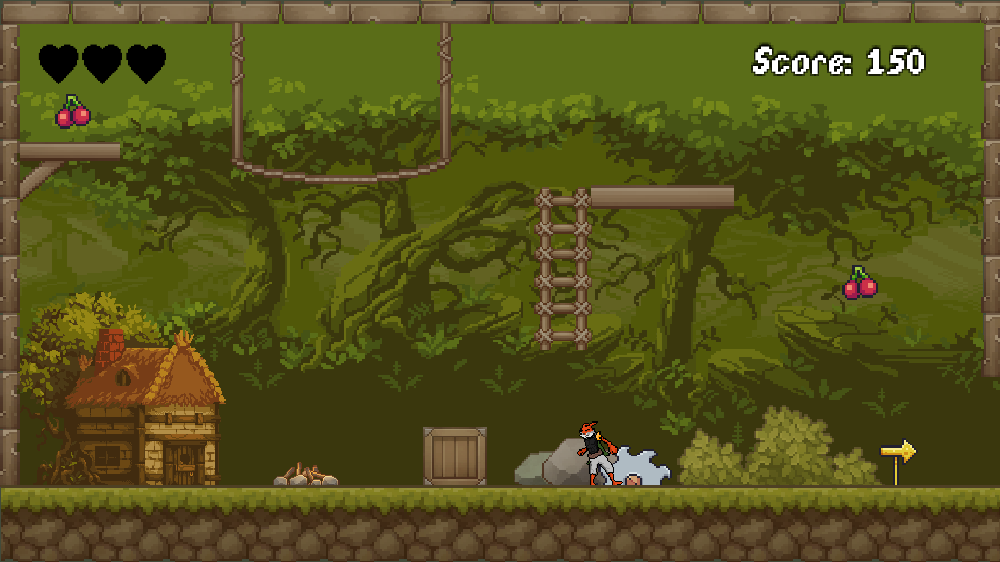
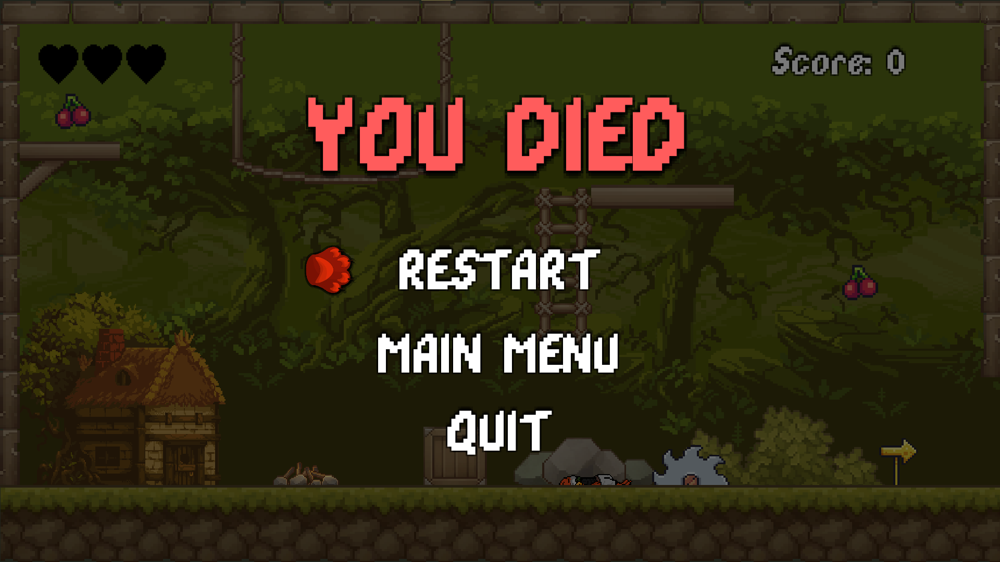
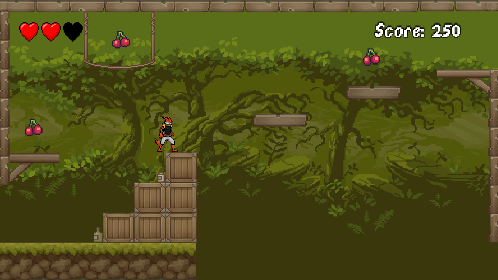
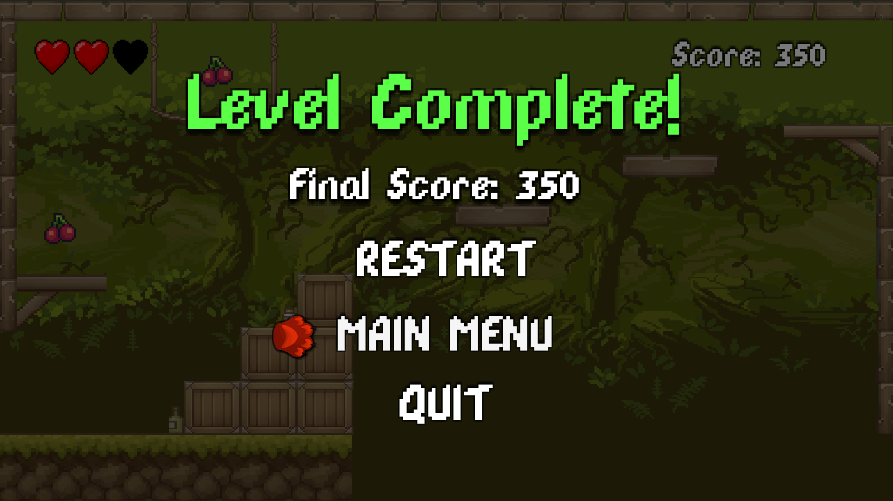
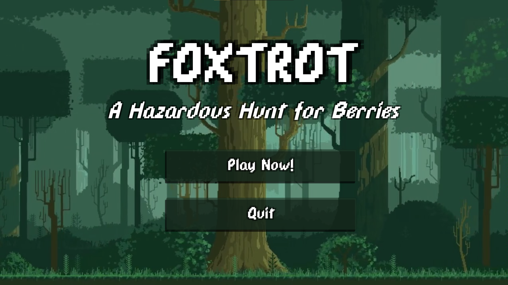

# Foxtrot
Foxtrot was a game made by myself during my time at Tresham College as a part of one of my unit assignments. This assignment focused on the whole process of game development, including multiple design stages, building, and testing to meet the requirements laid out by the client.

The languages and applications used for this project were C# to create the scripts and the Unity engine.

# Play The Game
To play the game, simply click on the green "Code" button, and when prompted, download the zip folder and extract it to wherever you would like on your PC. The file you need to open is the application file under the name "FoxTrot".

# Screenshots

